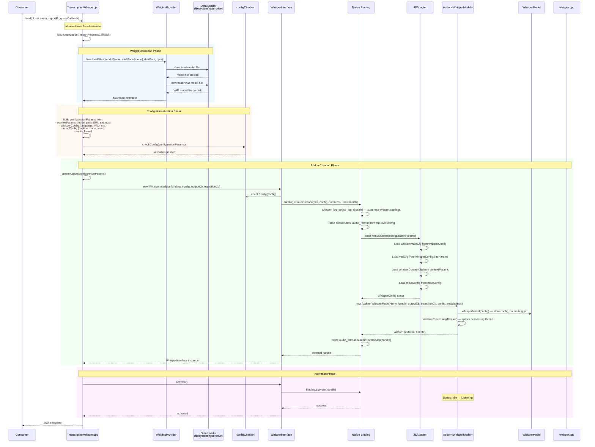
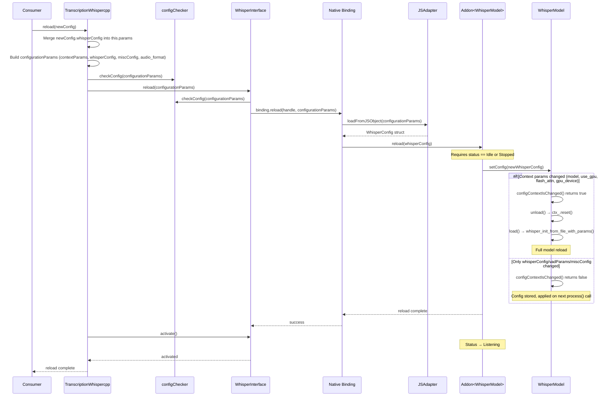
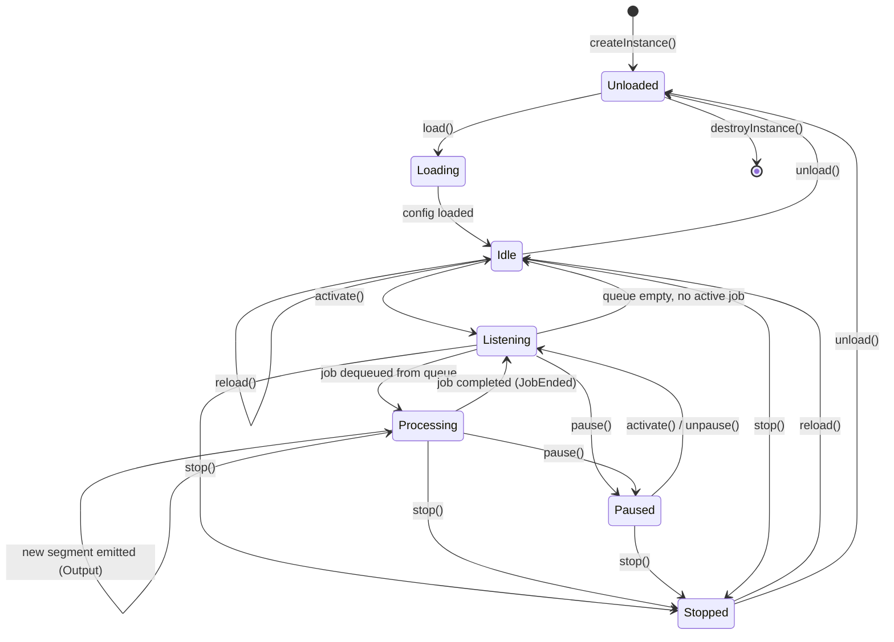
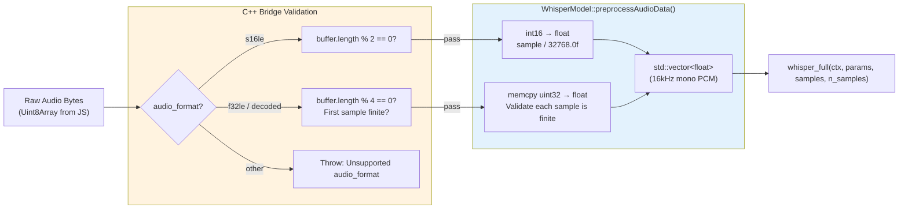
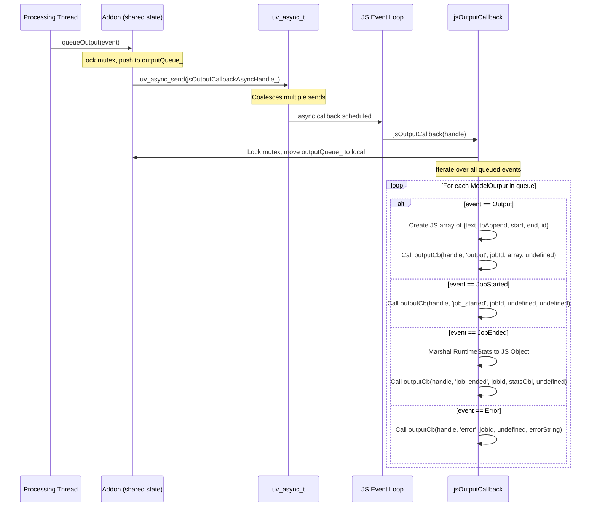

# Data Flows: @qvac/transcription-whispercpp

> **⚠️ Staleness Warning:** These diagrams were generated from the codebase at a point in time and may become outdated as the code evolves. When debugging or verifying behavior, regenerate these diagrams from the current source code rather than relying on this document as the sole source of truth.

---

## 1. Model Loading & Initialization Flow

This flow covers what happens when a consumer calls `load()` on a `TranscriptionWhispercpp` instance.



<details>
<summary>📊 LLM-Friendly: Loading Sequence</summary>

| Phase | Step | Component | Action |
|-------|------|-----------|--------|
| Weight Download | 1 | TranscriptionWhispercpp | Calls `_load()` |
| Weight Download | 2 | WeightsProvider | Downloads whisper model + VAD model to disk |
| Config Normalization | 3 | TranscriptionWhispercpp | Builds `configurationParams` (contextParams, whisperConfig, miscConfig, audio_format) |
| Config Normalization | 4 | configChecker | Validates all param keys against whitelists |
| Addon Creation | 5 | WhisperInterface | Constructor calls `binding.createInstance()` |
| Addon Creation | 6 | Native Binding | Disables whisper.cpp logging, parses top-level config |
| Addon Creation | 7 | JSAdapter | Converts JS object to `WhisperConfig` struct (4 variant maps) |
| Addon Creation | 8 | Addon\<WhisperModel\> | Constructed with config, spawns processing thread |
| Addon Creation | 9 | WhisperModel | Stores config only — model not loaded yet |
| Activation | 10 | WhisperInterface | `activate()` → status transitions to Listening |

</details>

---

## 2. Transcription (Audio Processing) Flow

This flow covers a complete transcription from `run()` through to receiving all segments.

```mermaid
flowchart TB
    START([Consumer calls run(audioStream)]) --> APPEND_EMPTY
    APPEND_EMPTY["append({type: 'audio', input: empty Uint8Array})<br/>Opens a new job, returns jobId"]
    APPEND_EMPTY --> CREATE_RESP["_createResponse(jobId)<br/>Creates QvacResponse with cancel/pause/continue handlers"]
    CREATE_RESP --> SPAWN_STREAM["_handleAudioStream(audioStream)<br/>Async: consumes stream in background"]
    SPAWN_STREAM --> RETURN_RESP["Return QvacResponse to consumer immediately"]

    SPAWN_STREAM --> STREAM_LOOP

    subgraph STREAM_LOOP ["Audio Stream Consumption (async)"]
        NEXT_CHUNK["for await (chunk of audioStream)"]
        NEXT_CHUNK --> APPEND_CHUNK["append({type: 'audio', input: Uint8Array(chunk)})"]
        APPEND_CHUNK --> BRIDGE_VALIDATE
        BRIDGE_VALIDATE["C++ Bridge: validate audio format<br/>s16le: buffer % 2 == 0<br/>f32le: buffer % 4 == 0, finite check"]
        BRIDGE_VALIDATE --> PREPROCESS["WhisperModel::preprocessAudioData()<br/>s16le → float (÷32768)<br/>f32le → float (memcpy)"]
        PREPROCESS --> ENQUEUE["addon.append(priority, floatSamples)<br/>Enqueue to job input, notify CV"]
        ENQUEUE --> NEXT_CHUNK
        NEXT_CHUNK -->|stream ends| SEND_EOF["append({type: 'end of job'})"]
        SEND_EOF --> EOF_CPP["endOfJob() → model.endOfStream()<br/>Sets stream_ended_ = true"]
    end

    subgraph PROC_THREAD ["Processing Thread (C++ — WhisperModelJobsHandler)"]
        WAIT["Wait on condition_variable (100ms timeout)"]
        WAIT -->|job in queue| DEQUEUE["Dequeue job, status → Processing"]
        DEQUEUE --> EMIT_STARTED["queueOutput(JobStarted, jobId)"]
        EMIT_STARTED --> SET_CB["Set onSegmentCallback on WhisperModel"]
        SET_CB --> LOAD_MODEL["model.load()<br/>whisper_init_from_file_with_params()"]
        LOAD_MODEL --> WARMUP{"First load?"}
        WARMUP -->|yes| DO_WARMUP["warmup(): whisper_full with 0.5s silence"]
        WARMUP -->|no| SKIP_WARMUP["Skip warmup"]
        DO_WARMUP --> CHECK_INPUT
        SKIP_WARMUP --> CHECK_INPUT
        CHECK_INPUT["Check: job has input data?"]
        CHECK_INPUT -->|yes| PROCESS["model.process(input)<br/>whisper_full(ctx, params, samples)"]
        CHECK_INPUT -->|no, stream not ended| WAIT
        PROCESS --> SEGMENT_CB["onNewSegment callback fires<br/>for each new segment"]
        SEGMENT_CB --> QUEUE_OUT["queueOutput(Output, jobId, segments)<br/>uv_async_send → JS callback"]
        QUEUE_OUT --> CHECK_STREAM{"stream_ended_<br/>& input empty?"}
        CHECK_STREAM -->|no| CHECK_INPUT
        CHECK_STREAM -->|yes| END_JOB["queueOutput(JobEnded, jobId, runtimeStats)<br/>model.reset(), status → Listening"]
    end

    QUEUE_OUT -.->|uv_async_send| JS_CB
    END_JOB -.->|uv_async_send| JS_CB_END

    subgraph JS_OUTPUT ["JS Output Callback (event loop)"]
        JS_CB["jsOutputCallback:<br/>Convert Model::Output → JS array<br/>{text, start, end, id, toAppend}"]
        JS_CB --> PUSH_RESP["BaseInference._outputCallback<br/>→ response.push(data)"]
        PUSH_RESP --> ON_UPDATE["Consumer: QvacResponse.onUpdate(segments)"]

        JS_CB_END["jsOutputCallback (JobEnded):<br/>Marshal runtimeStats to JS Object"]
        JS_CB_END --> FINISH_RESP["response.finish(stats)"]
        FINISH_RESP --> ON_FINISH["Consumer: QvacResponse.onFinish(allOutputs)"]
    end

    style START fill:#f0f0f0
    style STREAM_LOOP fill:#e8f5e9
    style PROC_THREAD fill:#e3f2fd
    style JS_OUTPUT fill:#fff3e0
```

<details>
<summary>📊 LLM-Friendly: Transcription Sequence</summary>

| Phase | Step | Component | Action |
|-------|------|-----------|--------|
| Initiation | 1 | TranscriptionWhispercpp | `run(audioStream)` → append empty audio to open job |
| Initiation | 2 | TranscriptionWhispercpp | `_createResponse(jobId)` → return QvacResponse immediately |
| Stream (async) | 3 | TranscriptionWhispercpp | `for await (chunk of audioStream)` loop |
| Stream (async) | 4 | Native Binding | Validate audio format, call `preprocessAudioData()` |
| Stream (async) | 5 | Addon | Enqueue float samples to job input, notify CV |
| Stream (async) | 6 | TranscriptionWhispercpp | Send `{type: 'end of job'}` when stream ends |
| Processing | 7 | WhisperModelJobsHandler | Dequeue job, emit `JobStarted`, set segment callback |
| Processing | 8 | WhisperModel | `load()` — `whisper_init_from_file_with_params()` + warmup |
| Processing | 9 | WhisperModel | `process(input)` — `whisper_full()` |
| Processing | 10 | whisper.cpp | `onNewSegment` fires for each decoded segment |
| Processing | 11 | Addon | Queue output, `uv_async_send` to JS |
| Processing | 12 | WhisperModelJobsHandler | When stream ended + input empty → emit `JobEnded` + stats |
| JS Callback | 13 | Addon::jsOutputCallback | Convert `Model::Output` to JS objects |
| JS Callback | 14 | BaseInference | Push to `QvacResponse` → consumer's `onUpdate` fires |
| JS Callback | 15 | BaseInference | `JobEnded` → `QvacResponse.onFinish(allOutputs)` |

</details>

---

## 3. Configuration Reload Flow

This flow covers what happens when `reload()` is called to change parameters without destroying the instance.



<details>
<summary>📊 LLM-Friendly: Reload Sequence</summary>

| Step | Component | Action |
|------|-----------|--------|
| 1 | TranscriptionWhispercpp | Merge `newConfig.whisperConfig` into existing `this.params` |
| 2 | TranscriptionWhispercpp | Build full `configurationParams` |
| 3 | configChecker | Validate parameter whitelist |
| 4 | WhisperInterface | `reload(configurationParams)` |
| 5 | Native Binding | Convert via JSAdapter → WhisperConfig |
| 6 | Addon | Assert status is Idle or Stopped |
| 7 | WhisperModel | `setConfig()` — checks if context changed |
| 8a (if context changed) | WhisperModel | `unload()` + `load()` — full model reload |
| 8b (if no context change) | WhisperModel | Store new config — applied on next `process()` |
| 9 | TranscriptionWhispercpp | `activate()` → status → Listening |

</details>

---

## 4. Addon State Machine

The addon follows a state machine managed by the shared `qvac-lib-inference-addon-cpp` framework.



<details>
<summary>📊 LLM-Friendly: State Transitions</summary>

| Current State | Trigger | Next State |
|---------------|---------|------------|
| (initial) | `createInstance()` | Unloaded |
| Unloaded | `load()` | Loading |
| Loading | config loaded | Idle |
| Idle | `activate()` | Listening |
| Listening | job dequeued | Processing |
| Processing | job completed | Listening |
| Listening | queue empty | Idle |
| Listening / Processing | `pause()` | Paused |
| Paused | `activate()` | Listening |
| Listening / Processing / Paused / Idle | `stop()` | Stopped |
| Stopped / Idle | `reload()` | Idle |
| Stopped / Idle | `unload()` | Unloaded |
| Unloaded | `destroyInstance()` | (destroyed) |

</details>

---

## 5. Audio Preprocessing Pipeline



<details>
<summary>📊 LLM-Friendly: Audio Pipeline</summary>

| Stage | Input | Output | Notes |
|-------|-------|--------|-------|
| JS Layer | Readable stream chunks | Uint8Array | From `@qvac/decoder-audio` or raw source |
| Bridge Validation | Uint8Array | Validated buffer | Checks alignment and format |
| Preprocessing (s16le) | int16 LE pairs | float [-1.0, 1.0] | Divide by 32768 |
| Preprocessing (f32le/decoded) | float32 LE quads | float (validated) | memcpy + finite check |
| whisper.cpp | float* + count | Transcript segments | 16kHz mono PCM expected |

</details>

---

## 6. Output Event Dispatch (C++ → JS)



<details>
<summary>📊 LLM-Friendly: Output Events</summary>

| OutputEvent | JS Callback Args (after handle) | data param | error param |
|------------|--------------------------------|------------|-------------|
| `JobStarted` | `'job_started', jobId` | undefined | undefined |
| `Output` | `'output', jobId` | Array of `{text, toAppend, start, end, id}` | undefined |
| `JobEnded` | `'job_ended', jobId` | RuntimeStats object | undefined |
| `Error` | `'error', jobId` | undefined | error message string |

**Thread safety:** The output queue is protected by `std::mutex`. `uv_async_send` coalesces multiple signals — `jsOutputCallback` drains the entire queue on each invocation.

</details>
